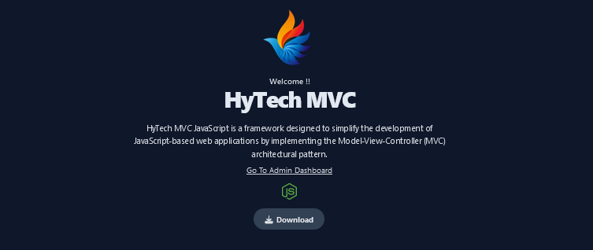

# MVC Javascript (NodeJS)



## Github Repository Clone 

```
git clone https://github.com/fitri-hy/mvc-nodejs.git
cd mvc-nodejs
npm install
npm start
```

## Folder Sructure 
```
ROOT
│
├── controllers/
│   ├── adminController.js
│   ├── pageController.js
│   └── toDoListController.js
│
├── models/
│   └── toDoListModel.js
│
├── node_modules/
│
├── public/
│   ├── css/
│   │   ├── admin_style.css
│   │   └── style.css
│   ├── images/
│   │   ├──logo/
│   │   │   └── logo.png
│   │   └──uploads/
│   │		└── og.png
│   └── js/
│		├── admin_main.js
│		└── main.js
│
├── routes/
│   ├── pageRoutes.js
│   └── toDoListRoutes.js
│
├── views/
│   ├── admin/
│   │   ├── components/
│   │   │   └── navbar.ejs
│   │   ├── partials/
│   │   │   ├── footer.ejs
│   │   │   └── head.ejs
│   │   └── index.ejs
│   │
│   ├── components/
│   │   └── navbar.ejs
│   ├── partials/
│   │   ├── footer.ejs
│   │   └── head.ejs
│   ├── about.ejs
│   ├── index.ejs
│   ├── layout.ejs
│   └── to-do-list.ejs
│
├── LICENSE
├── app.js
├── package.json
├── package-lock.json
└── README.md
```
